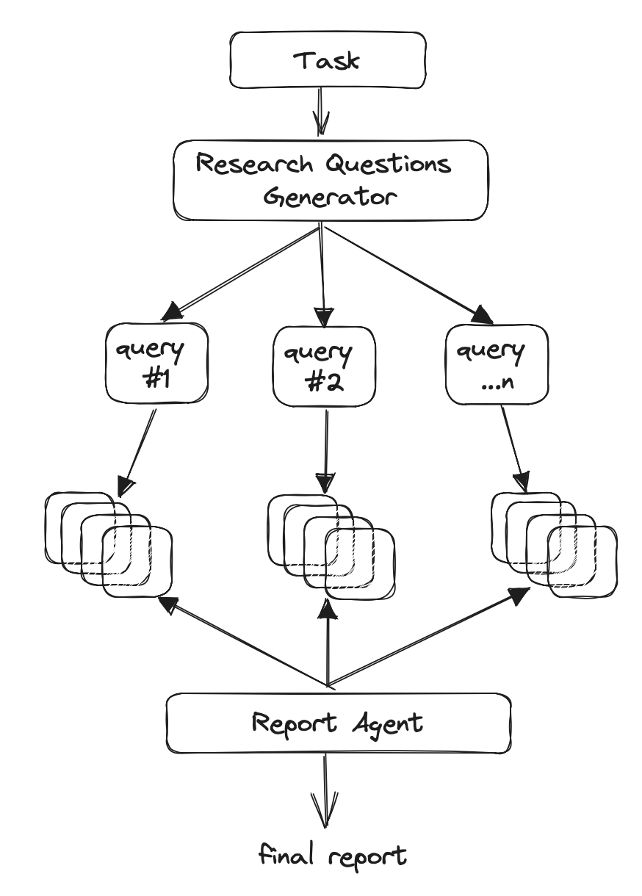

# LangChain research assistant

## what is this ?

This repo holds the code for an autonomous research agent, building up on this excellent [LangChain web search assistant YouTube tutorial](https://www.youtube.com/watch?v=DjuXACWYkkU). It can search:

- Arxiv papers summaries
- the web

## how to use

- `cp .env.example .env` (and fill in the blanks)
- `pip install -r requirements.txt`
- `python3 main.py`
- go to `localhost:8000` and search for something:
    - on Arvix (papers summaries) by going to `/generate-arxiv-search-report/playground/` route
    - on the web by going to `/generate-web-search-report/playground/` route

## how it works

The search feature is heavily inspired by https://github.com/assafelovic/gpt-researcher, which basically splits up one search into multiple sub searches before generating a final report =>

